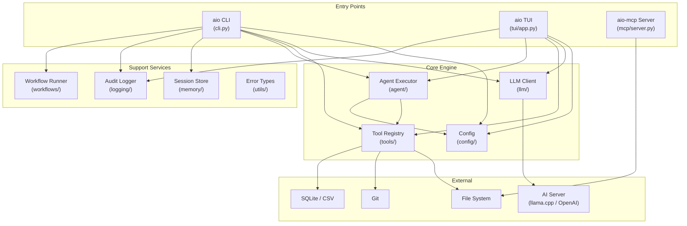
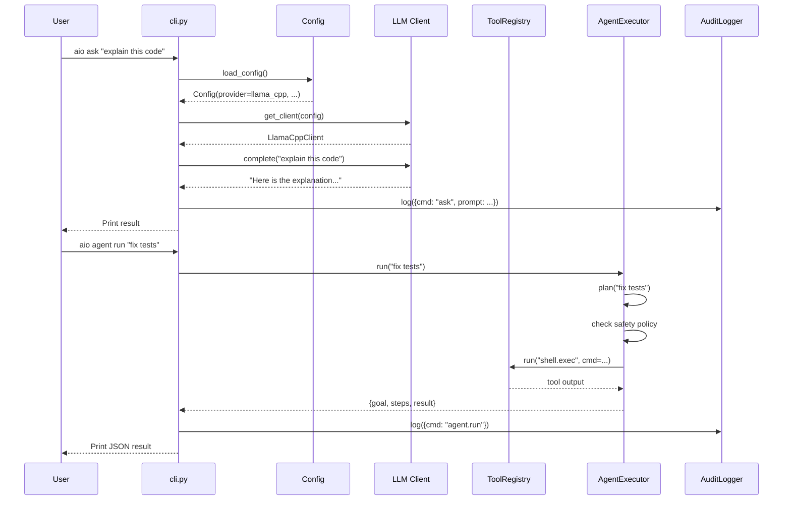
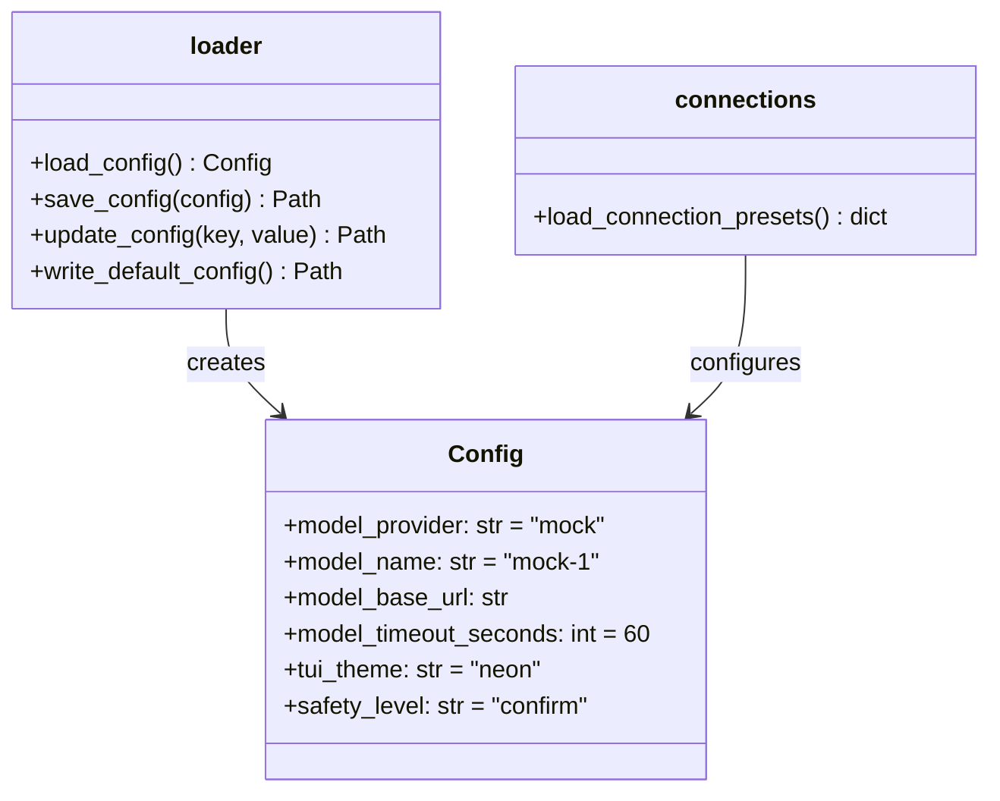
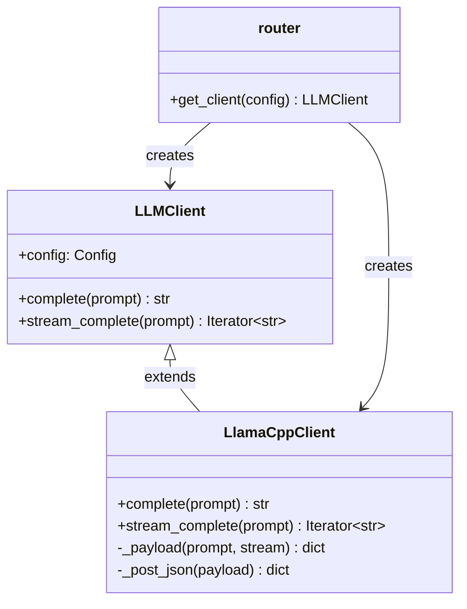
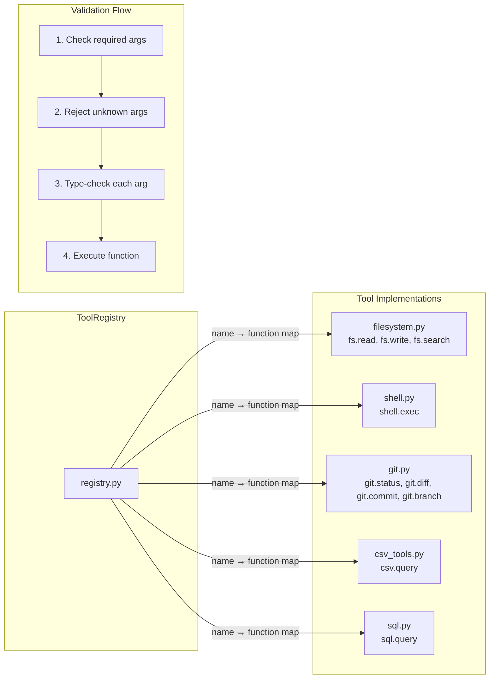
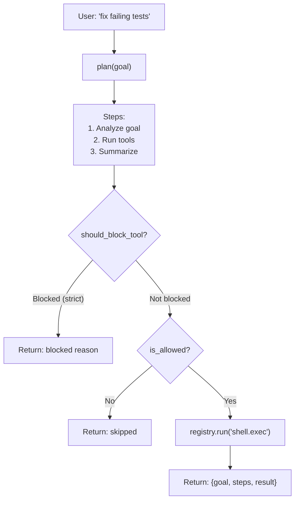
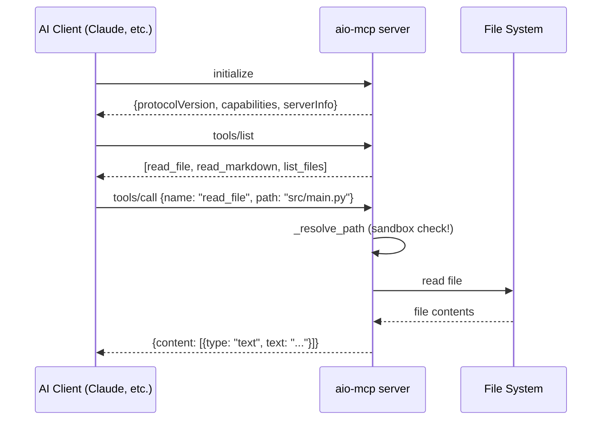
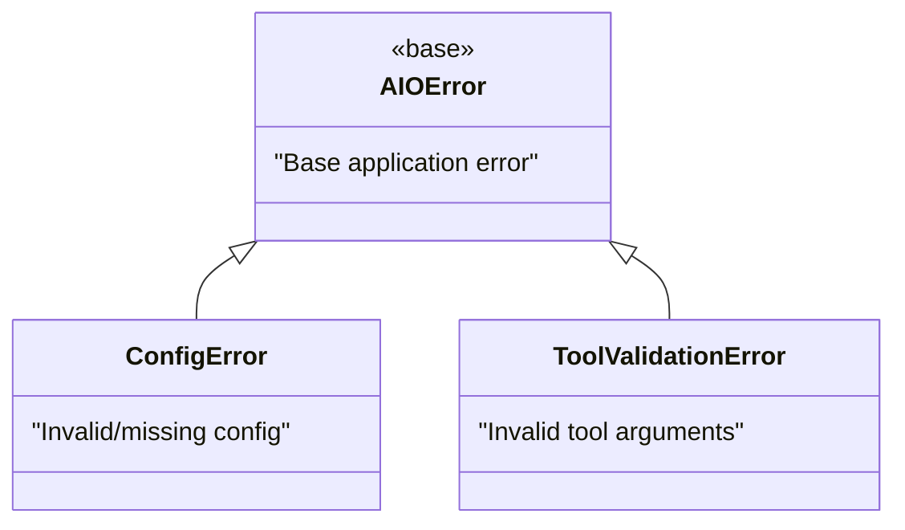
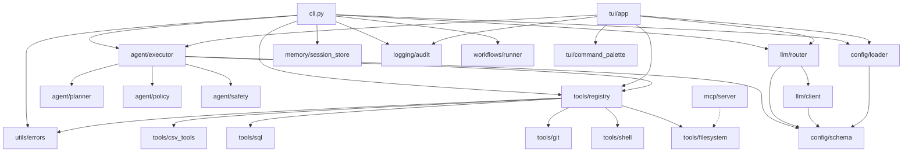

# All-in-One AI CLI — Project Architecture

## 🛠️ Execution Status: Executing
### 🔍 Points of Uncertainty
* None identified — all source files were read directly.

---

## What Is This Project?

**all-in-one-ai-cli** (called `aio`) is a **terminal-based AI assistant** written in Python. Think of it as a command-line tool where you can:

1. **Chat with an AI** (like ChatGPT, but in your terminal)
2. **Run tools** (read files, search code, run shell commands, query databases)
3. **Run an agent** that plans and executes multi-step tasks
4. **Connect to local AI servers** (llama.cpp, Ollama, LM Studio) — no cloud needed

It has two entry points:
- `aio` — the main CLI and TUI (Terminal User Interface)
- `aio-mcp` — an MCP server that exposes tools over stdio

---

## High-Level Architecture



---

## How a User Request Flows Through the System



---

## Module-by-Module Breakdown

### 📁 Directory Tree

```
src/aio/
├── cli.py              ← Main CLI entry point (argparse)
├── config/
│   ├── schema.py       ← Config dataclass (the "shape" of settings)
│   ├── loader.py       ← Read/write YAML config files
│   └── connections.py  ← Local AI server presets
├── llm/
│   ├── client.py       ← LLM client classes (mock + llama.cpp)
│   └── router.py       ← Factory: picks the right client
├── tools/
│   ├── registry.py     ← Central tool registry + validation
│   ├── filesystem.py   ← File read/write/search tools
│   ├── shell.py        ← Shell command execution
│   ├── git.py          ← Git operations (status, diff, commit)
│   ├── csv_tools.py    ← CSV file querying
│   └── sql.py          ← SQLite database querying
├── agent/
│   ├── executor.py     ← Agent loop: plan → check → act
│   ├── planner.py      ← Step planner (stub)
│   ├── policy.py       ← "Is this tool allowed?"
│   └── safety.py       ← "Is this tool risky?"
├── tui/
│   ├── app.py          ← Textual TUI (734 lines!)
│   └── command_palette.py ← Ctrl+K command search modal
├── mcp/
│   └── server.py       ← MCP protocol server (JSON-RPC over stdio)
├── memory/
│   └── session_store.py ← Session persistence (JSONL)
├── logging/
│   └── audit.py        ← Audit trail (JSONL per day)
├── workflows/
│   └── runner.py       ← Workflow runner (stub)
└── utils/
    └── errors.py       ← Custom exception hierarchy
```

---

## Module Details & Patterns

### 1️⃣ Config (`config/`)

#### What it does
Manages all application settings. Reads/writes a YAML file at `.aio/config.yaml`.

#### Files

| File | What | Pattern | Why It's Good |
|:--|:--|:--|:--|
| [schema.py](file:///d:/H%20Drive/git/all-in-one-ai-cli/src/aio/config/schema.py) | **Data class** with 6 fields (provider, model name, URL, timeout, theme, safety level) | **Dataclass** (`@dataclass`) | A single source of truth for "what settings exist." Adding a new setting = add one line. Python auto-generates `__init__`, `__repr__`, `__eq__`. |
| [loader.py](file:///d:/H%20Drive/git/all-in-one-ai-cli/src/aio/config/loader.py) | Reads YAML, writes defaults, updates individual keys | **Custom minimal parser** (no PyYAML dependency) | Avoids adding `pyyaml` as a dependency for V1. Simple `key: value` parsing is enough for flat configs. |
| [connections.py](file:///d:/H%20Drive/git/all-in-one-ai-cli/src/aio/config/connections.py) | Stores presets for local AI servers (llama.cpp, LM Studio, Ollama) | **Preset pattern** with JSON persistence | Users can add custom servers by editing `.aio/connections.json`. Defaults are auto-generated if missing. |



> **Junior tip:** A **dataclass** is Python's way of saying "this is just a container for data." Instead of writing `__init__`, `__repr__`, etc. by hand, you add `@dataclass` and Python generates them. It makes your code shorter and less error-prone.

---

### 2️⃣ LLM Client (`llm/`)

#### What it does
Sends prompts to AI models and gets responses back. Supports both one-shot and streaming modes.

| File | What | Pattern | Why It's Good |
|:--|:--|:--|:--|
| [client.py](file:///d:/H%20Drive/git/all-in-one-ai-cli/src/aio/llm/client.py) | Base `LLMClient` (mock) + `LlamaCppClient` (real HTTP client) | **Inheritance / Strategy** | The base class returns mock responses (for testing). The subclass adds real HTTP calls. You can swap implementations without changing the rest of the code. |
| [router.py](file:///d:/H%20Drive/git/all-in-one-ai-cli/src/aio/llm/router.py) | `get_client(config)` → picks the right client class | **Factory Pattern** | One function decides which client to create based on config. The rest of the code just calls `client.complete()` — it doesn't care *which* client it is. |



> **Junior tip:** The **Factory Pattern** is when you have a function that creates objects for you. Instead of writing `if provider == "llama_cpp": client = LlamaCppClient(...)` everywhere, you write it once in `get_client()` and call that everywhere else. If you add a new provider later, you only change one place.

> **Junior tip:** **Streaming** means getting the AI's response word-by-word instead of waiting for the whole thing. `stream_complete()` uses Python's `yield` keyword to send each chunk as it arrives. This makes the UI feel responsive — the user sees text appearing in real-time.

---

### 3️⃣ Tools (`tools/`)

#### What it does
A collection of small, focused functions that the AI agent can call. Each tool does one thing (read a file, run a command, query a database).

| File | What | Pattern | Why It's Good |
|:--|:--|:--|:--|
| [registry.py](file:///d:/H%20Drive/git/all-in-one-ai-cli/src/aio/tools/registry.py) | Central registry that maps tool names → functions, validates arguments, and runs tools | **Registry Pattern** + **Schema Validation** | All tools are in one place. Validation happens *before* execution, so bad arguments are caught early with clear error messages. |
| [filesystem.py](file:///d:/H%20Drive/git/all-in-one-ai-cli/src/aio/tools/filesystem.py) | `read_text`, `write_text`, `search_text` | **Pure functions** (no side effects besides I/O) | Each function does exactly one thing. Easy to test, easy to understand. |
| [shell.py](file:///d:/H%20Drive/git/all-in-one-ai-cli/src/aio/tools/shell.py) | Runs shell commands via `subprocess` | **Wrapping stdlib** | Wraps Python's `subprocess.run` with sensible defaults (capture output, don't crash on errors). |
| [git.py](file:///d:/H%20Drive/git/all-in-one-ai-cli/src/aio/tools/git.py) | Git operations: status, diff, commit, branch | **Helper function extraction** (`_run_git`) | All git commands share a single helper that handles path validation, error catching, and the `subprocess` call. DRY (Don't Repeat Yourself). |
| [csv_tools.py](file:///d:/H%20Drive/git/all-in-one-ai-cli/src/aio/tools/csv_tools.py) | Reads CSV files, optionally filtering by columns | **DictReader** (stdlib) | Uses Python's `csv.DictReader` so every row is a dictionary (`{column: value}`). Column filtering is optional. |
| [sql.py](file:///d:/H%20Drive/git/all-in-one-ai-cli/src/aio/tools/sql.py) | Runs SQL queries against SQLite databases | **Row factory** (`sqlite3.Row`) | Uses `conn.row_factory = sqlite3.Row` so results come back as dicts instead of tuples — much easier to work with. |



> **Junior tip:** The **Registry Pattern** is like a phone book for functions. Instead of calling `filesystem.read_text(path)` directly, you call `registry.run("fs.read", path="README.md")`. Why? Because the *AI agent* doesn't know Python — it knows tool names. The registry translates `"fs.read"` → the actual function.

> **Junior tip:** **Schema validation** means checking that the arguments are correct *before* running the tool. `ToolArgSpec` defines "this tool needs a `path` argument of type `str`." If someone passes the wrong type or forgets a required arg, they get a helpful error instead of a crash.

---

### 4️⃣ Agent (`agent/`)

#### What it does
The "brain" that takes a goal ("fix failing tests"), breaks it into steps, checks safety rules, and runs tools.

| File | What | Pattern | Why It's Good |
|:--|:--|:--|:--|
| [executor.py](file:///d:/H%20Drive/git/all-in-one-ai-cli/src/aio/agent/executor.py) | `AgentExecutor.run(goal)` → plan → safety check → execute | **Orchestrator / Pipeline** | Clean separation: planning, policy checking, and execution are separate steps. Easy to add more steps later (e.g., "observe results" → "replan"). |
| [planner.py](file:///d:/H%20Drive/git/all-in-one-ai-cli/src/aio/agent/planner.py) | Returns a list of steps for a goal (currently a stub) | **Strategy (placeholder)** | Isolated so it can be replaced with a real LLM-powered planner without changing anything else. |
| [policy.py](file:///d:/H%20Drive/git/all-in-one-ai-cli/src/aio/agent/policy.py) | `is_allowed(safety_level, tool_name)` → True/False | **Policy / Guard** | Simple boolean gate. "In strict mode, shell tools are blocked." Clear, testable, one function. |
| [safety.py](file:///d:/H%20Drive/git/all-in-one-ai-cli/src/aio/agent/safety.py) | `should_block_tool(level, name, approved)` → (blocked, reason) | **Guard with explanation** | Returns *why* a tool was blocked (not just True/False). The user sees "Use --approve-risky" instead of a silent failure. |



> **Junior tip:** The agent uses a **two-layer safety check** — first `should_block_tool` (hard block with explanation), then `is_allowed` (soft policy check). This is a common pattern in security: "deny first, then verify." Having two separate functions makes each one easy to test independently.

---

### 5️⃣ TUI (`tui/`)

#### What it does
A full **Terminal User Interface** built with [Textual](https://textual.textualize.io/) — a modern Python framework for building terminal apps with CSS-like styling.

| File | What | Pattern | Why It's Good |
|:--|:--|:--|:--|
| [app.py](file:///d:/H%20Drive/git/all-in-one-ai-cli/src/aio/tui/app.py) | 734-line `AIOConsole` app: chat, commands, markdown panel, themes, streaming | **Component-based UI** (Textual's `App` + `ComposeResult`) | Textual lets you build terminal UIs like web apps — with CSS layouts, event handlers, and composable widgets. Much more robust than raw `curses`. |
| [command_palette.py](file:///d:/H%20Drive/git/all-in-one-ai-cli/src/aio/tui/command_palette.py) | Ctrl+K popup for searching and selecting commands | **Modal Screen** (Textual's `ModalScreen`) | A floating overlay with search filtering. Follows the same pattern as VS Code's command palette. |

> **Junior tip:** **Textual** is like React, but for the terminal. You define widgets (like `Input`, `RichLog`, `MarkdownViewer`), compose them in `compose()`, and handle events with methods like `on_input_submitted()`. The `CSS` string controls layout — just like styling a web page.

> **Junior tip:** The `@work(thread=True)` decorator in `_handle_chat_background` runs the AI call on a background thread. This prevents the TUI from freezing while waiting for the AI to respond. The UI stays responsive, and results appear when ready.

---

### 6️⃣ MCP Server (`mcp/`)

#### What it does
Implements the [Model Context Protocol (MCP)](https://modelcontextprotocol.io/) — a standard protocol that lets AI tools talk to external servers. aio's MCP server exposes 3 tools: `read_file`, `read_markdown`, `list_files`.

| File | What | Pattern | Why It's Good |
|:--|:--|:--|:--|
| [server.py](file:///d:/H%20Drive/git/all-in-one-ai-cli/src/aio/mcp/server.py) | Full JSON-RPC 2.0 server over stdio | **Protocol implementation** + **Path sandboxing** | Implements the MCP spec from scratch. `_resolve_path` ensures files can only be read inside the project root — a real security measure. No external deps. |



> **Junior tip:** **JSON-RPC 2.0** is a protocol where the client sends JSON requests like `{"method": "tools/call", "params": {...}, "id": 1}` and the server sends JSON responses. The `id` field links requests to responses. The `_read_message` / `_write_message` functions handle the framing (Content-Length headers).

> **Junior tip:** **Path sandboxing** (`_resolve_path`) is crucial. It uses `.resolve()` to get the absolute path, then checks `candidate.relative_to(root)`. If someone tries `path: "../../etc/passwd"`, the resolve will escape the root directory and `relative_to` will raise `ValueError`. This prevents directory traversal attacks.

---

### 7️⃣ Memory (`memory/`)

| File | What | Pattern | Why It's Good |
|:--|:--|:--|:--|
| [session_store.py](file:///d:/H%20Drive/git/all-in-one-ai-cli/src/aio/memory/session_store.py) | Stores chat messages as JSONL (one JSON object per line) | **Append-only log** | JSONL is perfect for chat logs — you just append new lines, never rewrite the whole file. Fast writes, easy to read back. Each session gets its own `.jsonl` file. |

> **Junior tip:** **JSONL** (JSON Lines) means each line is a valid JSON object. Compare to a single JSON array — with JSONL, you can append without reading the whole file. This is the same format used by OpenAI's fine-tuning data format.

---

### 8️⃣ Logging (`logging/`)

| File | What | Pattern | Why It's Good |
|:--|:--|:--|:--|
| [audit.py](file:///d:/H%20Drive/git/all-in-one-ai-cli/src/aio/logging/audit.py) | Per-day JSONL audit trail with UTC timestamps | **Structured logging** + **Daily rotation** | Machine-readable logs (JSON, not plain text). One file per day means old logs are naturally organized. `aio replay` can show them. |

> **Junior tip:** Every log entry gets a UTC `ts` (timestamp) automatically. Using UTC (not local time) avoids timezone confusion when debugging. The `datetime.now(timezone.utc).isoformat()` call gives you something like `"2026-03-07T15:48:00+00:00"`.

---

### 9️⃣ Utils (`utils/`)

| File | What | Pattern | Why It's Good |
|:--|:--|:--|:--|
| [errors.py](file:///d:/H%20Drive/git/all-in-one-ai-cli/src/aio/utils/errors.py) | `AIOError` → `ConfigError`, `ToolValidationError` | **Exception hierarchy** | All app errors inherit from `AIOError`. You can `except AIOError` to catch *any* app error, or `except ToolValidationError` for just tool errors. Python best practice. |



---

## Module Dependency Graph

This shows which modules depend on which. Arrows point from "depends on" → "dependency".



---

## Key Design Patterns Summary

| Pattern | Where Used | One-Line Explanation |
|:--|:--|:--|
| **Dataclass** | `Config` | Auto-generated container for settings — less boilerplate |
| **Factory** | `get_client()` | One function that decides which class to create |
| **Registry** | `ToolRegistry` | Phone book: maps string names to functions |
| **Strategy / Inheritance** | `LLMClient` → `LlamaCppClient` | Swap AI providers without changing the caller |
| **Append-only Log** (JSONL) | `SessionStore`, `AuditLogger` | Fast writes, easy replay, no file corruption |
| **Path Sandboxing** | `_resolve_path()` in MCP | Prevents reading files outside the project |
| **Exception Hierarchy** | `AIOError` tree | Catch broad or specific errors as needed |
| **Guard / Policy** | `should_block_tool`, `is_allowed` | Two-layer safety with explanatory messages |
| **Modal Overlay** | `CommandPalette` | Floating UI over the main screen (like VS Code Ctrl+K) |
| **Background Worker** | `@work(thread=True)` | Non-blocking AI calls in the TUI |
| **JSON-RPC 2.0** | MCP server | Standard wire protocol for tool communication |
| **Daily Rotation** | `AuditLogger` | One log file per day — automatic organization |

---

## Entry Points (from `pyproject.toml`)

```toml
[project.scripts]
aio = "aio.cli:main"         # → cli.py main()
aio-mcp = "aio.mcp.server:main"  # → mcp/server.py main()
```

These are installed as system commands when you run `pip install -e .`

After installation:
- `aio ask "hello"` → calls `cli.py:main()`
- `aio tui` → launches the Textual TUI
- `aio-mcp --root .` → starts the MCP server
