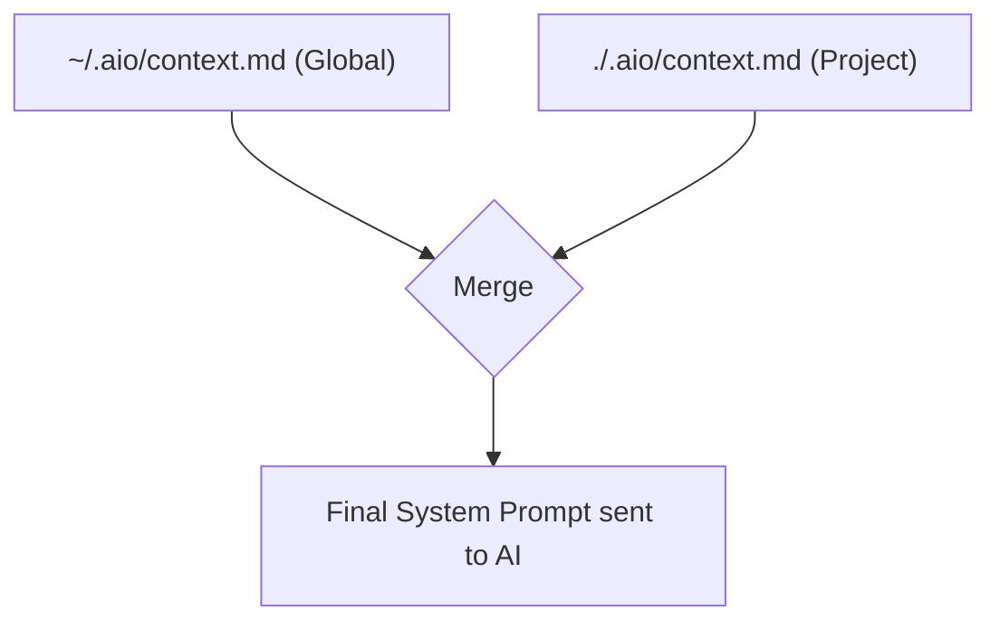

# Phase 1 — Project Context & Memory

## What This Phase Does (Big Picture)

Right now, every time you chat with the AI in aio, it has **zero memory** of your project. It doesn't know your coding conventions, your project structure, or anything from previous sessions.

This phase adds a **project context file** (`.aio/context.md`) — a markdown file where you write instructions like "Always use TypeScript" or "This is a Django project." The AI reads this file before every conversation.

> **Junior tip:** Think of it like giving the AI a "cheat sheet" about your project before every conversation, so it doesn't ask the same questions over and over.

## Inspired By

| Tool | How They Do It |
|:--|:--|
| **Claude Code** | `CLAUDE.md` — hierarchical files loaded from `~/.claude/`, project root, and subdirectories |
| **Gemini CLI** | `GEMINI.md` — same concept, with `/memory add/show/refresh` commands |

## Design Patterns Used

### 1. Hierarchical Config Merge

- **One-Line ELI5:** Settings from multiple levels (global → project → subfolder) are stacked on top of each other, with more specific ones winning.
- **Why Here:** A developer might have global preferences ("always use Python 3.11") plus project-specific ones ("this project uses Flask"). Both should apply, but project-level overrides global.
- **Real Analogy:** Like dress codes — your company has a global dress code, but your team might have its own rules. You follow both, but your team's rules take priority when they conflict.



### 2. Append-Only Log (for memory)

- **One-Line ELI5:** Instead of rewriting a whole file, you just add new lines at the end.
- **Why Here:** When the user says `\memory add "use tabs not spaces"`, we append to `context.md` instead of parsing and rewriting it. Fast, safe, no data loss.
- **Real Analogy:** Like a notebook — you don't erase and rewrite pages, you just write on the next empty line.

## Files to Create/Modify

```
src/aio/
├── memory/
│   ├── session_store.py   (existing, untouched)
│   └── context.py         ← NEW
├── llm/
│   └── client.py          ← MODIFY (inject context as system message)
└── tui/
    └── app.py             ← MODIFY (add \memory commands)
```

---

## Detailed Implementation

### [NEW] `src/aio/memory/context.py`

**Purpose:** Discover and load `.aio/context.md` files from multiple locations.

```python
# Key functions:

def load_project_context(project_root: Path) -> str:
    """
    Looks for context files in this order:
    1. ~/.aio/context.md  (global — your personal preferences)
    2. <project>/.aio/context.md  (project — shared team settings)
    3. <subdir>/.aio/context.md  (subfolder — module-specific context)
    
    Concatenates all found files with headers between them.
    Returns the combined text, or empty string if none found.
    """

def append_memory(fact: str, project_root: Path) -> Path:
    """
    Appends a fact to the project's .aio/context.md file.
    Creates the file if it doesn't exist.
    Returns the path to the file.
    """
```

**Why we use `Path.home() / ".aio/context.md"`:** This is the user's global config. Using `Path.home()` is the Python standard way to find the user's home directory, cross-platform (works on Windows, Mac, Linux).

### [MODIFY] `src/aio/llm/client.py`

**What changes:** The `_payload()` method in `LlamaCppClient` currently sends only a `user` message. We add an optional `system` message at the start of the messages array.

```python
# Before:
def _payload(self, prompt: str, stream: bool) -> dict:
    return {
        "messages": [{"role": "user", "content": prompt}],
        ...
    }

# After:
def _payload(self, prompt: str, stream: bool, system_prompt: str = "") -> dict:
    messages = []
    if system_prompt:
        messages.append({"role": "system", "content": system_prompt})
    messages.append({"role": "user", "content": prompt})
    return {
        "messages": messages,
        ...
    }
```

> **Junior tip:** The `system` role in chat APIs tells the AI "these are your instructions" vs `user` which is "this is what the human said." The AI treats system messages as background context, not as something to directly respond to.

### [MODIFY] `src/aio/tui/app.py`

**What changes:** Add 3 new TUI commands in `_execute_line_sync`:

| Command | What It Does |
|:--|:--|
| `\memory show` | Prints the full loaded context |
| `\memory add <text>` | Appends a fact to `.aio/context.md` |
| `\memory refresh` | Reloads context from disk |

---

## Tests

### [NEW] `tests/test_context.py`

```python
def test_load_context_missing_file_returns_empty(tmp_path):
    # No .aio/context.md exists → should return ""
    
def test_load_context_reads_project_file(tmp_path):
    # Create .aio/context.md with "Always use Python"
    # Verify load_project_context() returns "Always use Python"
    
def test_append_memory_creates_and_appends(tmp_path):
    # Append "use tabs", then "use 4 spaces"
    # Verify both lines are in the file
```

## How to Verify Manually

1. Run `aio init` (creates `.aio/` folder)
2. Create `.aio/context.md` with: `Always respond in Vietnamese.`
3. Run `aio tui`
4. Type `hello` → AI should respond in Vietnamese because of the context
5. Type `\memory add Use type hints everywhere.`
6. Type `\memory show` → Should display both lines
