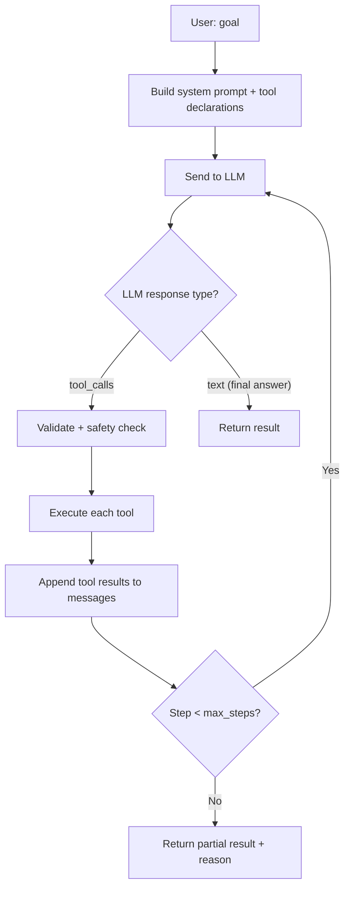

# Phase 3 — Real Agent Loop with Function Calling

## What This Phase Does (Big Picture)

Right now, the `AgentExecutor` is a **mock**. It calls `plan()` which returns hardcoded strings, then runs a single shell command. It doesn't actually talk to an AI.

This phase replaces it with a **real agent loop** — the AI receives your goal, decides which tools to call, executes them, sees the results, and keeps going until the task is done (or hits a step limit).

> **Junior tip:** Think of it like a chef (the AI) in a kitchen (your computer). You say "make me pasta." The chef *thinks* about what to do, *grabs* ingredients (runs tools), *checks* the result (reads output), and *decides* what to do next. The agent loop is this think→act→observe cycle.

## Inspired By

| Tool | How They Do It |
|:--|:--|
| **Claude Code** | Tool-use API — the AI returns `tool_calls`, the client executes them, sends results back |
| **Gemini CLI** | Function declarations — same concept, different format |
| **OpenCode** | Tool chaining — AI calls tools in sequence |

## Design Patterns Used

### 1. ReAct Loop (Reason + Act)

- **One-Line ELI5:** The AI alternates between *thinking about what to do* and *doing it*, looking at results between each step.
- **Why Here:** A single LLM call can't solve complex tasks. The AI needs to see outputs from tools to decide what to do next. ReAct is the standard pattern for agentic AI.
- **Real Analogy:** Like a doctor — examine the patient (observe), think about what's wrong (reason), run a test (act), look at results (observe again), repeat until diagnosis is clear.



### 2. Function Calling (OpenAI-compatible)

- **One-Line ELI5:** Instead of the AI writing "I'll now run `shell.exec echo hello`" in plain text (which we'd have to parse), it returns structured JSON: `{"tool_calls": [{"function": {"name": "shell.exec", "arguments": {"cmd": "echo hello"}}}]}`.
- **Why Here:** Structured output is reliable. Plain text parsing breaks easily ("did the AI mean to run a tool or just mention it?"). Function calling is the industry standard.
- **Real Analogy:** Like filling out a form vs writing a letter. A form has specific fields (name, arguments), so there's no ambiguity. A letter could say anything in any format.

### 3. Message History (Conversation Threading)

- **One-Line ELI5:** Each step (user message, AI response, tool result) is added to a growing list of messages. The AI sees the full history on every turn.
- **Why Here:** The AI needs to remember what it already tried. If `fs.search` returned 5 files, the AI needs that list in context when deciding what to do next.
- **Real Analogy:** Like a group chat — everyone (including the AI) can scroll up and see what was said before.

## Files to Modify

```
src/aio/
├── llm/
│   └── client.py          ← MODIFY (add chat_with_tools method)
├── agent/
│   ├── executor.py        ← MODIFY (real iterative loop)
│   └── planner.py         ← MODIFY (generate tool declarations)
└── config/
    └── schema.py          ← MODIFY (add agent_max_steps)
```

---

## Detailed Implementation

### [MODIFY] `src/aio/llm/client.py`

**Add new method** to `LlamaCppClient`:

```python
def chat_with_tools(
    self, 
    messages: list[dict], 
    tools: list[dict],
    system_prompt: str = ""
) -> dict:
    """
    Sends a chat request with tool declarations.
    
    Uses the OpenAI-compatible /v1/chat/completions endpoint.
    llama.cpp, Ollama, LM Studio, and vLLM all support this format.
    
    Parameters:
    - messages: the conversation history
      [{"role": "user", "content": "..."}, 
       {"role": "assistant", "tool_calls": [...]},
       {"role": "tool", "tool_call_id": "...", "content": "..."}]
    - tools: tool declarations in OpenAI format
      [{"type": "function", "function": {"name": "...", "parameters": {...}}}]
    
    Returns:
    - dict with "role", "content", and optionally "tool_calls"
    """
```

> **Junior tip:** The OpenAI chat format has 4 roles: `system` (instructions), `user` (human), `assistant` (AI), and `tool` (tool results). Each message has a role and content. This is how the AI knows who said what.

**Also add** to base `LLMClient`:
```python
def chat_with_tools(self, messages, tools, system_prompt=""):
    # Mock implementation for testing — just returns a text response
    return {"role": "assistant", "content": f"Processed: {messages[-1].get('content', '')}"}
```

### [MODIFY] `src/aio/agent/planner.py`

**Replace the stub** with a function that converts `ToolRegistry` schemas into OpenAI tool declarations:

```python
def build_tool_declarations(registry: ToolRegistry) -> list[dict]:
    """
    Converts our ToolArgSpec format into OpenAI function calling format.
    
    Input (our format):
        ToolArgSpec(name="path", expected_type=str, required=True)
    
    Output (OpenAI format):
        {"type": "function", "function": {
            "name": "fs.read",
            "description": "Read a text file",
            "parameters": {
                "type": "object",
                "properties": {"path": {"type": "string"}},
                "required": ["path"]
            }
        }}
    
    Why this translation:
    - Our internal format (ToolArgSpec) is simple and Pythonic
    - The LLM needs JSON Schema format
    - This function bridges the two worlds
    """
```

> **Junior tip:** `JSON Schema` is a standard format for describing the shape of JSON data. When we say `{"type": "string"}`, we're telling the AI "this argument should be a text value." The AI uses this to generate valid tool calls.

### [MODIFY] `src/aio/agent/executor.py`

**Replace the entire `run()` method** with:

```python
def run(self, goal: str, approve_risky: bool = False) -> dict:
    """
    The real agent loop:
    
    Step 1: Load project context (from Phase 1)
    Step 2: Build tool declarations
    Step 3: Create initial messages [system, user(goal)]
    Step 4: LOOP:
        - Call LLM with messages + tools
        - If AI returns tool_calls:
            - For each tool call:
                a. Safety check (should_block_tool)
                b. Validate args (registry._validate_kwargs)  
                c. Execute (registry.run)
                d. Append result as "tool" message
        - If AI returns text: break — we have the final answer
        - If step count >= max_steps: break with timeout reason
    Step 5: Return {goal, steps_taken, result, tool_calls_made}
    """
```

### [MODIFY] `src/aio/config/schema.py`

```python
@dataclass
class Config:
    # ... existing fields ...
    agent_max_steps: int = 10  # Maximum tool-call iterations per agent run
```

---

## Tests

### [MODIFY] `tests/test_agent.py`

```python
def test_agent_loop_calls_tools(mock_client):
    # Mock LLM to return a tool_call on first call, text on second
    # Verify: tool was executed, result was returned

def test_agent_loop_max_steps(mock_client):
    # Mock LLM to always return tool_calls
    # Verify: loop stops at max_steps, returns partial result

def test_agent_loop_safety_blocks_tool(mock_client):
    # Mock LLM to call "shell.exec" in strict mode
    # Verify: tool blocked, reason included in result

def test_agent_loop_no_tools_immediate_response(mock_client):
    # Mock LLM to return text immediately (no tool_calls)
    # Verify: result contains the text, steps_taken = 1
```

## How to Verify Manually

1. Ensure a local LLM server is running (llama.cpp / Ollama)
2. Set config: `model_provider: llama_cpp`
3. Run: `aio agent run "list all markdown files in this project" --approve-risky`
4. Expected: AI calls `fs.search` or `shell.exec`, finds files, returns a list
5. Run: `aio agent run "read README.md and summarize it"`
6. Expected: AI calls `fs.read`, reads the file, returns a summary
